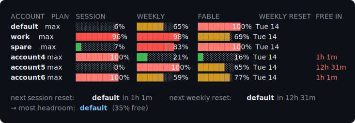

# cclimits

**See the usage limits of every Claude Code account you own, at once.**

Claude Code's built-in `/usage` shows you one account — the one you're logged into. If you
run several accounts (personal, work, a spare for when the weekly limit bites), the only way
to know where you stand is to log into each one and look. `cclimits` reads them all in
parallel and prints one table.



Bars are green under 50%, amber to 80%, red above. **WEEKLY RESET** is the local calendar day
each account's weekly window rolls over — the number you plan around when a weekly limit is
close. **FREE IN** counts down to the reset of an account's binding limit — the exact wait once
an account is fully spent, and a heads-up once that limit crosses 90%, before it actually blocks
you. The account with the most room to work in is called out at the bottom.

Accounts are named after their config directory, so `~/.claude-work` shows up as `work`.
**No email address is fetched or stored** unless you ask for one with `--email`, which adds a
trailing **EMAIL** column — so screenshots and status lines stay clean by default, and the
rows keep the short name you actually type to switch.

It shows every limit the API reports:

- **Session** — the rolling 5-hour window.
- **Weekly** — the 7-day window across all models.
- **Model-scoped weekly limits** — whatever the API returns. Today that includes **Fable**,
  which has its own weekly cap. No model name is hardcoded, so when a promotional model
  ends or a new one appears, `cclimits` picks it up with no code change.

## Install

```bash
uv tool install cclimits      # or: pipx install cclimits
```

Requires Python 3.9+. **No dependencies** — it's stdlib only, so it won't drag a dependency
tree into your shell prompt.

Run from a clone instead:

```bash
git clone https://github.com/acrdlph/cclimits && cd cclimits
PYTHONPATH=src python3 -m cclimits.cli
```

## Usage

```bash
cclimits                    # the table above
cclimits --detail           # every limit, expanded, with reset times
cclimits --email            # add an EMAIL column with each account's address
cclimits --watch            # live, refreshing every 180s
cclimits --json             # machine-readable
cclimits --html usage.html  # a self-contained dashboard file
cclimits --best             # print only the config dir with the most headroom
cclimits --refresh          # bypass the 60s cache
```

`--detail` marks the limit that's actually blocking you:

```
work  /Users/you/.claude-work
  Session    ████████████  96%  resets in 1h 2m
  Weekly     ████████████ 100%  resets in 2d 18h  ← blocking you now
  Fable      ████████░░░░  69%  resets in 2d 18h
```

### Switching accounts: the `cc` command

Typing `CLAUDE_CONFIG_DIR=~/.claude-account4 claude` gets old fast. Add the shell integration
to your `~/.zshrc` (or `~/.bashrc`):

```bash
eval "$(cclimits --shell-init zsh)"    # or: bash
```

That gives you `cc`, with tab completion:

```bash
cc              # show the usage table
cc --email      # show the table with an EMAIL column
cc 4            # switch to ~/.claude-account4   (1 = your default ~/.claude)
cc work         # switch to ~/.claude-work
cc best         # switch to whichever account has the most headroom
cc which        # print the account currently in use
```

Flags belong to `cclimits` and are forwarded to it, so `cc --detail`, `cc --watch` and the
rest work from `cc` too.

Anything after the account is run on it, so you can switch and launch in one go:

```bash
cc 4 claude
cc best claude --dangerously-skip-permissions
cc 2 claude -p "summarise this repo"
```

Arguments are passed straight through, so every `claude` flag works without `cc` needing to
know about any of them.

The switch applies to your current shell, so a later bare `claude` runs on that account too,
until you change it or close the terminal. It has to be a shell function rather than a plain
executable — a child process cannot export a variable back into the shell that started it.

"Most headroom" is the account with the most room on its *binding* limit — the worse of its
session and weekly numbers. Model-scoped limits are deliberately excluded from that ranking:
an exhausted Fable cap doesn't stop you using Sonnet, so it shouldn't make an otherwise-free
account look unusable.

---

## Setting up multiple Claude accounts

`cclimits` doesn't create accounts — it reads whatever you've already set up. If you don't
have a multi-account setup yet, here's the whole thing.

Claude Code isolates an account by **config directory**, via the `CLAUDE_CONFIG_DIR`
environment variable. Each directory gets its own credentials, settings, history, projects,
and MCP servers. Two terminals can run two different accounts at the same time, with no
logging in and out.

**1. Log each account into its own directory.** Run this once per account; a browser opens
for the OAuth flow:

```bash
CLAUDE_CONFIG_DIR=~/.claude            claude   # your default account
CLAUDE_CONFIG_DIR=~/.claude-work       claude   # a second one
CLAUDE_CONFIG_DIR=~/.claude-spare      claude   # a third, and so on
```

Any directory name works. `cclimits` autodiscovers `~/.claude` and `~/.claude-*`.

**2. Add the shell integration** so switching is one word. In `~/.zshrc` or `~/.bashrc`:

```bash
eval "$(cclimits --shell-init zsh)"    # or: bash
```

That gives you [`cc`](#switching-accounts-the-cc-command) — `cc 2`, `cc best`, `cc 4 claude`.
`CLAUDE_CONFIG_DIR` is read per process, so a switch only affects the shell you make it in.

**3. Check where you stand:**

```bash
cclimits
```

### Where the credentials actually live

Worth knowing, because it's what makes per-account reads possible:

- **macOS** — the system Keychain, one entry per config directory, under the service name
  `Claude Code-credentials-<first 8 hex of sha256(config_dir_path)>`. The default `~/.claude`
  uses the unsuffixed `Claude Code-credentials`.
- **Linux / Windows** — a `.credentials.json` file inside the config directory itself.

`cclimits` supports both.

> A word of restraint: multiple accounts are for people who legitimately have multiple
> subscriptions — a personal one and an employer-provided one, say. Pooling accounts to get
> around the limits of a plan you're paying for is between you and
> [Anthropic's usage policy](https://www.anthropic.com/legal/aup); this tool takes no view,
> it just reports the numbers.

---

## Non-standard config directories

Autodiscovery covers `~/.claude` and `~/.claude-*`. For anything else, name them explicitly:

```bash
cclimits --dir ~/work/.claude --dir /opt/team/.claude
```

Or set `CLAUDE_CONFIG_DIRS` (plural) to a `:`-separated list to make it the default:

```bash
export CLAUDE_CONFIG_DIRS=~/.claude:/opt/team/.claude
```

## Status line

`--json` is stable; script against that rather than the table.

```bash
cclimits --json | python3 -c '
import json, sys
for a in json.load(sys.stdin)["accounts"]:
    if not a["ok"]:
        continue
    weekly = next(l["percent"] for l in a["limits"] if l["label"] == "Weekly")
    print("%s %.0f%%" % (a["slug"], weekly), end="  ")
'
```

Results are cached for 60 seconds, so calling `cclimits` on every shell prompt costs nothing
and won't get you rate limited.

## Safety

**`cclimits` is strictly read-only.** It issues two `GET` requests and nothing else.

- **It never writes, refreshes, or rotates your tokens.** This is deliberate. Refreshing a
  token means the server may rotate the refresh token; a tool that did that and failed to
  persist the new one would silently break your real Claude Code login. So when an access
  token has expired, `cclimits` tells you to run `claude` in that directory once — it does not
  try to fix it itself.
- **Your tokens never leave your machine**, except to `api.anthropic.com`, which issued them.
- **It doesn't touch your email addresses** unless you pass `--email`. Without that flag the
  profile endpoint is never called and no address is written to the cache, so the output is
  safe to screenshot or pipe into a shared status line.
- **It doesn't impersonate the Claude Code client.** It sends an honest
  `User-Agent: cclimits/<version>`.
- It reads credentials only from the Keychain / `.credentials.json`, and never logs or prints
  a token.

## How it works

Two undocumented endpoints — the ones Claude Code's own `/usage` command calls:

| Endpoint | Used for |
| --- | --- |
| `GET https://api.anthropic.com/api/oauth/usage` | session, weekly and model-scoped limits |
| `GET https://api.anthropic.com/api/oauth/profile` | the account's email — **only when `--email` is passed** |

Both take `Authorization: Bearer <oauth access token>` and `anthropic-beta: oauth-2025-04-20`.

**Stability caveat:** these endpoints are not documented or guaranteed by Anthropic. They
power a feature in the shipping client, so they're unlikely to vanish quietly, but the schema
could change. `cclimits` parses defensively — a payload it doesn't fully recognise degrades to
reporting the limits it *can* still read, rather than crashing. If Anthropic ever ships a
supported endpoint for this, `cclimits` should switch to it.

This only works for **subscription (Pro/Max) accounts** authenticated via OAuth. API-key
billing (`ANTHROPIC_API_KEY`) has no session/weekly limits to report, and those accounts are
reported as such.

## Prior art

`cclimits` is not the first tool to read these endpoints, and it doesn't try to replace the
ones that came before it. Its one real contribution is the **multi-account view**.

- **[ccusage](https://github.com/ryoppippi/ccusage)** — reads your *local* transcript files to
  report token counts and dollar costs. Different data source, different question: it tells
  you what you spent, not how close you are to a limit.
- **[wakamex/ccusage](https://github.com/wakamex/ccusage)** — reads the same
  `/api/oauth/usage` endpoint this tool does, and renders it into the Claude Code status line.
  If you have **one** account and want a status line, use this; it's the more focused tool.
- **[Claude-Code-Usage-Monitor](https://github.com/Maciek-roboblog/Claude-Code-Usage-Monitor)** —
  a live terminal dashboard with burn-rate estimates and predictions.

Use `cclimits` when you have *several* accounts and the question you keep asking is "which one
still has room?"

## Development

```bash
git clone https://github.com/acrdlph/cclimits && cd cclimits
PYTHONPATH=src uv run --with pytest --no-project pytest tests/ -q
```

The tests are offline — no network, no Keychain.

The images are generated from the real renderer, so they cannot drift from what the tool
actually prints. Regenerate them after any change to the output:

```bash
python3 scripts/make_screenshot.py                                   # -> docs/screenshot.svg, docs/social.svg
rsvg-convert -w 1280 -h 640 docs/social.svg -o docs/social.png       # GitHub rejects SVG here
```

`docs/social.png` is the 1280×640 link-preview card. It is not picked up from the repo
automatically — upload it under **Settings → General → Social preview**.

## License

MIT. Not affiliated with or endorsed by Anthropic.
